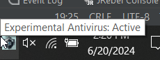
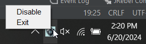
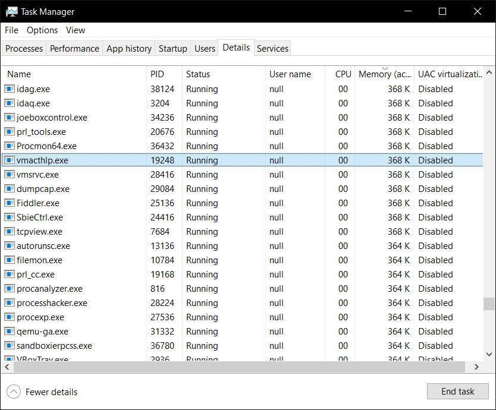

# Experimental-Antivirus
Just a tiny experiment, for the real application you should use https://github.com/NavyTitanium/Fake-Sandbox-Artifacts

## About
Assuming the malware you could be exposed to is checking the active processes - for reverse engineering tools and then safely shuts itself down if found - we can abuse that by pretending to be those tools.

## Links
https://github.com/NavyTitanium/Fake-Sandbox-Artifacts

## Requires
Java 1.8
Windows 10 (Earlier versions would probably work fine)

## Notes
May have issues on 32bit operating systems - just recompile the BlankProcess.exe to solve this.